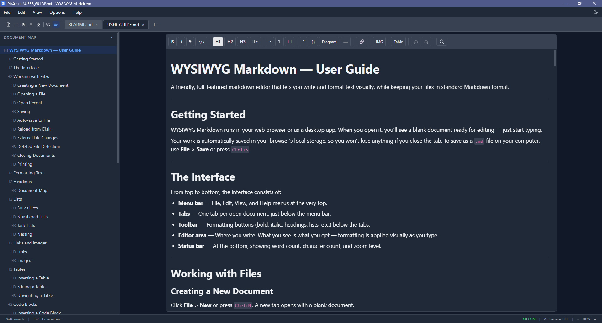

# WYSIWYG Markdown Editor

A WYSIWYG editor that produces clean GitHub Flavored Markdown. Edit visually — export Markdown. Runs in the browser or as a native desktop app via Tauri.

Users interact with a familiar rich-text interface while the application maintains a Markdown document behind the scenes. No split-pane, no syntax knowledge required.



## Features

### Editing
- **Rich text formatting** — bold, italic, underline, strikethrough, inline code
- **Headings** — H1–H6 with toolbar buttons and dropdown menu
- **Lists** — ordered, unordered (with dash/star/plus markers), and task lists with nesting
- **Tables** — visual grid picker or manual size input, with add/delete rows and columns, merge/split cells, toggle header row, and resize handles
- **Code blocks** — fenced blocks with syntax highlighting (highlight.js) and 40+ language options
- **Mermaid diagrams** — ` ```mermaid ` blocks render as diagrams (read-only) with a per-block toggle to edit the raw source and re-render, plus an expanded viewer (**⤢ Expand** / `Alt+Enter`) with mouse-wheel zoom and click-drag pan
- **Links and images** — insert and edit via dialogs with floating toolbars on selection (images display in-editor from `http(s)://` URLs; see [Known Limitations](#known-limitations))
- **Blockquotes and horizontal rules**
- **Markdown shortcuts** — optionally type `# `, `**`, etc. to trigger formatting (toggle on/off)
- **Backslash escapes** — type `\*`, `\#`, `\&`, etc. (any punctuation character) to insert literal markdown characters without triggering formatting; words with internal underscores like `snake_case` never turn italic

### Find & Replace
- **Find** (Ctrl+F) — search with match count and navigation between results
- **Replace** (Ctrl+H) — replace single or all occurrences
- **Search options** — match case, whole word, and regex support

### Navigation & View
- **Multi-document tabs** — open and switch between multiple documents (Ctrl+Tab / Ctrl+Shift+Tab)
- **Tab management** — drag to reorder, double-click to rename, right-click context menu
- **Markdown preview** (Ctrl+M) — side panel showing raw Markdown output
- **Document map** (Ctrl+D) — heading outline sidebar with click-to-jump navigation
- **Zoom** — Ctrl+=/−/0 or Ctrl+scroll wheel, with presets from 50% to 200%
- **Theme** — light, dark, or system (auto-follows OS preference)

### File Management
- **Open / Save / Save As** — `.md` files via native file pickers
- **Copy as Markdown** — export editor content to clipboard as Markdown
- **Copy as HTML** — export editor content to clipboard as raw HTML
- **Copy as Plain Text** (Ctrl+Shift+C) — export content stripped of all formatting
- **Export as HTML** — save a standalone styled `.html` file
- **Reload from disk** (F5) — re-read the file, discarding unsaved changes
- **External change detection** — watches open files for changes by other apps, with per-tab indicators and a reload prompt
- **Deleted file detection** — warns when an open file is deleted from disk, with Save As option; detects file recreation
- **Print** (Ctrl+P) — print the current document
- **Auto-save** — documents persist to browser localStorage (1s debounce)
- **Auto-save to file** — optional setting to write changes directly to disk (4s debounce)
- **Line ending preservation** — detects CRLF/LF on open and preserves on save
- **Tab indicators** — asterisk for unsaved changes, blue dot for external file modifications, amber dot for deleted files
- **Scroll position memory** — remembers scroll position per tab, scrolls to top on file open

### Status Bar
- **Word count** and **character count** for the current document
- **Zoom level** display with +/− controls

### Help
- **Keyboard shortcuts** (F1) — reference dialog listing all shortcuts
- **User guide** — in-app documentation covering all features

### Desktop App (Tauri)
- Native file dialogs and window title integration
- **Recent files** menu for quick access
- **Session restoration** — re-opens previously open files on launch
- **File associations** — register as handler for `.md` / `.markdown` files

### Keyboard Accessibility
- No keyboard trap (WCAG 2.1.2 compliant)
- Context-aware Tab key: indent in lists, navigate table cells, insert spaces in code blocks
- Escape then Tab exits the editor to browser focus navigation

## Getting Started

```bash
npm install
npm run dev
```

Open [http://localhost:5173](http://localhost:5173).

### Desktop (Tauri)

Requires the [Tauri prerequisites](https://v2.tauri.app/start/prerequisites/) (Rust toolchain).

```bash
npm run tauri:dev    # development
npm run tauri:build  # production
```

### Production Web Build

```bash
npm run build        # outputs to dist/
npm run preview      # serve the build locally
```

## Platform Support

The **web build runs anywhere** with a current browser — it is plain static output with no platform-specific code.

The **desktop build has only been built and tested on Windows.** Nothing in it is deliberately Windows-only, and the Rust source contains no platform-gated code beyond the standard `windows_subsystem` attribute, so macOS and Linux builds are expected to work. They are simply unverified — treat them as untested rather than unsupported.

| Platform | Web | Desktop |
|----------|-----|---------|
| Windows | ✅ Supported | ✅ Built and tested by hand |
| macOS | ✅ Supported | ⚠️ Builds in CI, not yet run by anyone |
| Linux | ✅ Supported | ⚠️ Builds in CI, not yet run by anyone |

CI compiles and bundles the desktop app on all three platforms on every push to `main`, so a build failure on macOS or Linux would be caught. But *compiling* is not *working* — nobody has yet launched the result on either platform and confirmed that the menus, file dialogs, watchers and diagram rendering behave.

Reports from anyone who runs a macOS or Linux build are very welcome — please open an issue either way, including success. Installers for every platform are attached to each CI run under **Actions → Desktop Build → Artifacts**, so you don't need a toolchain to try one.

### Known Caveats for Untested Platforms

These are identified from the code rather than from a failed build:

- **Opening a file from Finder will not work on macOS.** The app reads its startup file path from `std::env::args()` (`src-tauri/src/main.rs`), which is how Windows and Linux pass it. macOS delivers file-open requests from Finder as Apple Events instead, surfaced by Tauri as `RunEvent::Opened`. The file association would register, but launching via it would open an empty document. Opening from within the app is unaffected.
- **`additionalBrowserArgs` in `tauri.conf.json` is a WebView2 setting**, so it applies to Windows only. It is ignored elsewhere and is harmless, but the flags it disables have no equivalent on WKWebView or WebKitGTK.
- **Builds are unsigned.** There is no code-signing or notarization configuration, so macOS Gatekeeper will block a downloaded build until it is explicitly allowed, and Windows SmartScreen will warn.
- **Linux prerequisites differ** — WebKitGTK and related system packages are needed beyond the Rust toolchain. See the [Tauri prerequisites](https://v2.tauri.app/start/prerequisites/) for your distribution.
- **File association behaviour varies by platform** and has only been exercised on Windows.

### Builds and Releases

Three workflows cover this:

| Workflow | Trigger | What it does |
|----------|---------|--------------|
| **CI** | every push and PR | Lint, test and build the web app on Node 22 and 24 |
| **Desktop Build** | push to `main`, PRs touching `src-tauri/`, manual | Compile and bundle the desktop app on Windows, macOS and Linux; attach installers to the run |
| **Release** | pushing a `v*` tag | Build all three platforms and attach the installers to a **draft** GitHub Release |

Releases are drafted rather than published automatically, so the binaries can be checked before anyone is offered them. To cut a release, tag a commit whose version matches `package.json`, `tauri.conf.json` and `Cargo.toml`, push the tag, then review and publish the draft:

```bash
git tag v1.5.2
git push origin v1.5.2
```

**All builds are unsigned.** macOS will report that the app "cannot be opened because the developer cannot be verified", and Windows SmartScreen will warn on first run. Signing needs a paid Apple Developer account and a Windows code-signing certificate, neither of which is configured.

## Tech Stack

| Layer | Technology |
|-------|-----------|
| Framework | React 19, TypeScript, Vite |
| Editor | TipTap (ProseMirror) |
| Styling | Tailwind CSS v4 (CSS-first config) |
| Markdown export | Turndown (HTML → Markdown) |
| Markdown import | Custom GFM parser (Markdown → HTML) |
| Syntax highlighting | highlight.js via lowlight |
| Diagrams | Mermaid (lazy-loaded) |
| Desktop | Tauri 2 |

## How It Works

```
Markdown file  →  markdownToHtml()  →  TipTap editor  →  htmlToMarkdown()  →  Markdown file
                  (custom parser)       (ProseMirror)      (Turndown)
```

- **Import**: A custom line-by-line parser converts GFM Markdown to HTML that TipTap understands.
- **Editing**: TipTap provides the WYSIWYG editing surface backed by a ProseMirror document model.
- **Export**: Turndown converts the editor's HTML back to clean ATX-style Markdown with GFM extensions (tables, task lists, strikethrough, fenced code blocks).
- **Line endings**: The original file's line endings (CRLF or LF) are detected on open and preserved on save.
- **Storage**: Documents auto-save to browser localStorage. All state lives in React — there is no external backend.

## Supported Markdown Elements

| Element | Syntax |
|---------|--------|
| Headings | `# H1` through `###### H6` |
| Bold | `**text**` |
| Italic | `*text*` |
| Strikethrough | `~~text~~` |
| Inline code | `` `code` `` |
| Fenced code blocks | ` ``` lang ` |
| Mermaid diagrams | ` ```mermaid ` |
| Unordered lists | `- item` / `* item` / `+ item` |
| Ordered lists | `1. item` |
| Task lists | `- [ ] todo` / `- [x] done` |
| Blockquotes | `> quote` |
| Links | `[text](url)` |
| Images | `` |
| Tables | GFM pipe tables |
| Horizontal rules | `---` |
| Backslash escapes | Any punctuation: `\*`, `\#`, `\&`, `\\`, etc. |

## Known Limitations

**Relative and local image paths do not render in the editor.** A reference such as `` is resolved by the webview against the application's own origin rather than against the directory of the open document, so it shows as a broken image. Images referenced by a full `http(s)://` URL display normally.

The Markdown itself is unaffected — the reference is preserved verbatim on save and renders correctly wherever paths resolve relative to the document, such as GitHub. Only the in-editor preview is affected. (The screenshot at the top of this README is exactly such a reference, which is why it renders here but would not render if you opened this file in the editor.)

Fixing this needs two things: resolving relative paths against the open document's directory, and enabling Tauri's asset protocol so the webview is permitted to load local files at all. The browser build is more constrained still, since the File System Access API provides a file handle rather than a path.

**Setext (underline-style) headings are not supported.** `Title` followed by a line of `===` is read as two paragraphs. Note that the `---` form is worse: `Title` followed by `---` becomes a paragraph plus a horizontal rule, because the `---` is matched as a thematic break first. Use ATX headings (`# Title`) instead.

## Contributing

Contributions are welcome — see [CONTRIBUTING.md](CONTRIBUTING.md) for setup, the checks CI runs, and notes on the round-trip fidelity requirement. For security issues, please see [SECURITY.md](SECURITY.md) rather than opening a public issue.

Release history is in [CHANGELOG.md](CHANGELOG.md).

## License

[MIT](LICENSE)
