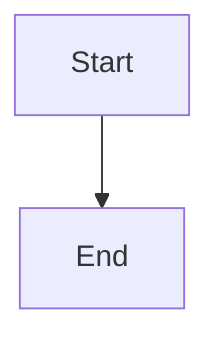

# WYSIWYG Markdown — User Guide

A friendly, full-featured markdown editor that lets you write and format text visually, while keeping your files in standard Markdown format.

---

## Getting Started

WYSIWYG Markdown runs in your web browser or as a desktop app. When you open it, you'll see a blank document ready for editing — just start typing.

Your work is automatically saved in your browser's local storage, so you won't lose anything if you close the tab. To save as a `.md` file on your computer, use **File > Save** or press `Ctrl+S`.

---

## The Interface

From top to bottom, the interface consists of:

- **Menu bar** — File, Edit, View, and Help menus at the very top.
- **Tabs** — One tab per open document, just below the menu bar.
- **Toolbar** — Formatting buttons (bold, italic, headings, lists, etc.) below the tabs.
- **Editor area** — Where you write. What you see is what you get — formatting is applied visually as you type.
- **Status bar** — At the bottom, showing word count, character count, and zoom level.

---

## Working with Files

### Creating a New Document

Click **File > New** or press `Ctrl+N`. A new tab opens with a blank document.

### Opening a File

Click **File > Open** or press `Ctrl+O`, then pick a `.md` file from your computer. You can also **drag and drop** a markdown file directly onto the editor.

### Open Recent

**File > Open Recent** shows files you've recently opened (desktop app only). You can clear this list from the same menu.

### Saving

- **Save** (`Ctrl+S`) — Saves to the file you originally opened. If this is a new document, it behaves like Save As.
- **Save As** (`Ctrl+Shift+S`) — Lets you choose a new filename or location.

### Auto-save to File

Turn on **View > Auto-save to File** to automatically save your changes to disk whenever you edit. This only works for documents that already have a file on disk (i.e., you've saved or opened them at least once).

### Reload from Disk

Press `F5` or use **File > Reload from Disk** to reload the current document from its file, discarding any unsaved changes in the editor.

### External File Changes

If a file is modified outside the app (e.g., by another editor), a blue dot appears on its tab and an info bar appears when you switch to it. You can click **Reload** to load the updated content, or **Dismiss** to keep your current version. This works for all open tabs, not just the active one.

### Deleted File Detection

If a file is deleted from disk while it's open in the editor, an amber dot appears on its tab and a warning bar appears when the tab is active. You can click **Save As** to save your content to a new location, or dismiss the warning and keep editing in memory. If the file is later recreated at the same path (e.g., by a `git checkout`), the warning transitions to the standard "modified externally" notification with a Reload option.

### Closing Documents

- **Close Tab** (`Ctrl+W`) — Closes the current tab. If there are unsaved changes, you'll be asked to save first.
- **Close Other Tabs** — Closes every tab except the current one.
- **Close All** — Closes all tabs.

### Printing

Press `Ctrl+P` or use **File > Print** to print the current document.

Printing produces a clean document rather than a picture of the editor: the menu bar, toolbar, tab bar and status bar are all left out, and the whole document prints across as many pages as it needs. The output is styled the same way as **Export as HTML**, and is always light even when the app is in dark mode. Mermaid diagrams print as rendered diagrams rather than as their source, and the document name is used for the print header and as the default filename when you print to PDF.

Page breaks avoid splitting code blocks, tables, block quotes and images wherever possible, and a table that runs over a page boundary repeats its header row. Note that local and relative image paths are not resolved, so an image that looks broken in the editor will also be blank in print; images with `http(s)://` addresses print normally.

---

## Formatting Text

Select text and click a toolbar button, or use keyboard shortcuts:

| Format | Toolbar | Shortcut |
|---|---|---|
| **Bold** | **B** | `Ctrl+B` |
| *Italic* | *I* | `Ctrl+I` |
| ~~Strikethrough~~ | ~~S~~ | `Ctrl+Shift+X` |
| `Inline code` | `</>` | `Ctrl+E` |
| Underline | — | `Ctrl+U` |

You can combine formats — for example, bold and italic at the same time.

---

## Headings

Use headings to organize your document into sections.

- Click **H1**, **H2**, or **H3** on the toolbar for the most common heading levels.
- Click the **H▾** dropdown for all six levels (H1 through H6), plus a "Paragraph" option to remove a heading.

### Document Map

Turn on **View > Document Map** (`Ctrl+D`) to show a sidebar listing all headings in your document. Click any heading to jump to it — handy for long documents.

---

## Lists

### Bullet Lists

Click the bullet button on the toolbar to start a bullet list. While in a bullet list, click the button again to open a menu where you can change the bullet style:

- **Dash** (•) — the default
- **Star** (○)
- **Plus** (■)

### Numbered Lists

Click **1.** on the toolbar to start a numbered (ordered) list.

### Task Lists

Click the **☐** button to create a checkbox list. Click a checkbox in the editor to toggle it.

### Nesting

Press `Tab` to indent a list item (make it a sub-item) and `Shift+Tab` to outdent it.

---

## Links and Images

### Links

Click the **link button** (🔗) on the toolbar. You'll be prompted for a URL and optional display text. If you select text first, it becomes the link text.

To remove a link, click on it and then click the **✕** button that appears on the toolbar.

A floating toolbar appears when you click a link, letting you open, edit, or remove it.

### Images

Click **IMG** on the toolbar to insert an image. You can provide a URL and alt text.

When you click on an image in the editor, a floating toolbar appears that lets you resize or edit the image properties.

#### Which Images Display

Images with a full web address — anything starting `https://` or `http://` — display normally in the editor.

**Images stored alongside your document do not currently display.** If a file contains a relative reference such as ``, or a path to a file on your computer, the editor shows a broken image placeholder instead of the picture.

This is a known limitation rather than a problem with your file. The reference itself is preserved exactly as written — it is saved back to the `.md` file untouched, and it will display correctly anywhere that resolves paths relative to the document, such as GitHub or a static site generator. Only the in-editor preview is affected.

If you need to see the image while editing, use the full web address of a hosted copy.

---

## Tables

### Inserting a Table

Click **Table** on the toolbar. A dialog lets you choose the number of rows and columns and whether to include a header row.

### Editing a Table

Once you're inside a table, the Table button becomes a dropdown menu with these options:

- **Add Column Before / After** — Insert a column next to the current one.
- **Delete Column** — Remove the current column.
- **Add Row Before / After** — Insert a row next to the current one.
- **Delete Row** — Remove the current row.
- **Toggle Header Row** — Turn the top row into a header (or back to a normal row).
- **Merge Cells** — Combine selected cells into one.
- **Split Cell** — Split a previously merged cell back into individual cells.
- **Delete Table** — Remove the entire table.

### Navigating a Table

Press `Tab` to move to the next cell and `Shift+Tab` to move to the previous cell.

---

## Code Blocks

### Inserting a Code Block

Click the **{ }** button on the toolbar to insert a code block.

### Choosing a Language

When your cursor is in a code block, click the code block button again to open a dropdown where you can select a language (JavaScript, Python, SQL, and many more). Syntax highlighting is applied automatically.

### Tab Indentation

Inside a code block, `Tab` inserts two spaces and `Shift+Tab` removes up to two leading spaces. This is different from the normal Tab behavior, which moves browser focus.

---

## Mermaid Diagrams

The editor renders [Mermaid](https://mermaid.js.org/) diagrams — flowcharts, sequence diagrams, Gantt charts, pie charts, class and state diagrams, and more — from ordinary Markdown code fences.

### Inserting a Diagram

Click the **Diagram** button on the toolbar to insert a starter flowchart. You can also open any Markdown file that contains a ` ```mermaid ` code block and it will render automatically.

### Viewing and Editing

Each diagram has two modes:

- **Graph view** (the default) — the rendered diagram, shown read-only. Hover over it to reveal the **⤢ Expand** and **✎ Edit** buttons.
- **Source view** — the raw Mermaid text, fully editable. Click **✎ Edit** (or double-click the diagram) to switch to it.

While editing, click **◧ View** or press `Escape` to render the diagram again with your changes. Diagrams follow the app theme automatically and re-render when you switch between light and dark mode.

If the Mermaid source contains a syntax error, the diagram area shows the error message instead of a broken image — switch back to Edit to fix the source.

### Expanded View (Zoom and Pan)

Inline diagrams are scaled to fit the width of your document, which makes large flowcharts and sequence diagrams hard to read. The expanded view opens a single diagram in a near-full-window overlay where you can magnify it and move around.

Open it in either of two ways:

- Hover the diagram and click **⤢ Expand**.
- Put the cursor anywhere inside a diagram and press `Alt+Enter`. This works in both graph and source view, so you never need the mouse.

The diagram opens scaled to fit the window. Controls:

| Action | Control |
|--------|---------|
| Zoom | Scroll wheel (zooms toward the pointer), trackpad pinch, the **−** / **+** buttons, or `+` / `-` |
| Pan | Click and drag, or the arrow keys (hold `Shift` to move further per press) |
| Fit to window | The **⤢** button, the percentage readout, or `0` |
| Close | `Escape`, the **×** button, or click outside the panel |

The expanded view is read-only — it never changes your document. Closing it returns the cursor to where it was, so you can carry on typing. The app's own zoom (`Ctrl+=` / `Ctrl+-`) is suspended while the view is open, so the scroll wheel always zooms the diagram rather than resizing your text.

### Markdown Output

A diagram is stored in your document exactly as a fenced code block:

````

````

This keeps your files portable — they render on GitHub, GitLab, and any other Mermaid-aware viewer.

---

## Blockquotes

Click the **"** button on the toolbar to toggle a blockquote.

When inside a blockquote, two extra buttons appear:

- **"»** — Nest the blockquote one level deeper.
- **«"** — Lift the blockquote out one level.

You can also use the shortcut `Ctrl+Shift+B` to toggle a blockquote.

---

## Find and Replace

### Opening Find

Press `Ctrl+F` or click the **search icon** on the toolbar to open the search bar.

### Opening Find & Replace

Press `Ctrl+H` or use **Edit > Find & Replace** to open the search bar with the replace field visible.

### Search Options

The search bar has toggle buttons for:

- **Match case** — Only find results that match uppercase/lowercase exactly.
- **Whole word** — Only match complete words, not partial matches.
- **Regex** — Treat the search term as a regular expression.

### Navigating Results

Use the **up/down arrows** in the search bar (or press `Enter` / `Shift+Enter`) to jump between matches. The match count is displayed.

### Replacing

Type a replacement in the replace field, then:

- Click **Replace** to replace the current match and advance to the next.
- Click **Replace All** to replace every match at once.

Press `Escape` to close the search bar.

---

## Markdown Preview

Toggle **View > Markdown Preview** or press `Ctrl+M` to show a side-by-side preview of the raw markdown output. This is useful if you want to see exactly what your file will look like in plain markdown.

---

## Tabs

Each open document gets its own tab above the editor.

### Switching Tabs

Click a tab, or use `Ctrl+Tab` to move to the next tab and `Ctrl+Shift+Tab` to move to the previous tab.

### Reordering Tabs

Drag a tab left or right to change its position.

### Renaming Tabs

Double-click a tab's name to rename it. Press `Enter` to confirm or `Escape` to cancel.

### Closing Tabs

Click the **×** on a tab, or press `Ctrl+W` to close the current tab. Right-click a tab for additional options (Close, Close Others, Close All).

An asterisk (\*) on a tab name indicates unsaved changes. A blue dot indicates the file was changed externally. An amber dot indicates the file was deleted from disk.

---

## Appearance

### Theme

Choose your preferred theme from **View > Theme**:

- **Light** — Light background with dark text.
- **Dark** — Dark background with light text.
- **System** — Follows your operating system's light/dark preference.

### Zoom

Adjust the editor zoom level:

- **Zoom In** — `Ctrl+=` (or the **+** button in the status bar)
- **Zoom Out** — `Ctrl+-` (or the **−** button in the status bar)
- **Reset Zoom** — `Ctrl+0` (or click the percentage in the status bar)

### Spellcheck

Toggle **View > Spellcheck** to enable or disable browser spellchecking in the editor.

---

## Keyboard Shortcuts

Press `F1` or open **Help > Keyboard Shortcuts** for a quick-reference dialog. Here's the full list:

### File

| Shortcut | Action |
|---|---|
| `Ctrl+N` | New document |
| `Ctrl+O` | Open file |
| `Ctrl+S` | Save |
| `Ctrl+Shift+S` | Save As |
| `Ctrl+W` | Close tab |
| `F5` | Reload from disk |
| `Ctrl+P` | Print |

### Formatting

| Shortcut | Action |
|---|---|
| `Ctrl+B` | Bold |
| `Ctrl+I` | Italic |
| `Ctrl+U` | Underline |
| `Ctrl+Shift+X` | Strikethrough |
| `Ctrl+E` | Inline code |
| `Ctrl+Shift+B` | Blockquote |

### Edit

| Shortcut | Action |
|---|---|
| `Ctrl+Z` | Undo |
| `Ctrl+Y` | Redo |
| `Ctrl+Shift+C` | Copy as Plain Text |
| `Ctrl+Shift+V` | Paste as Markdown |
| `Ctrl+F` | Find |
| `Ctrl+H` | Find & Replace |

### Navigation

| Shortcut | Action |
|---|---|
| `Ctrl+Tab` | Next tab |
| `Ctrl+Shift+Tab` | Previous tab |

### View

| Shortcut | Action |
|---|---|
| `Ctrl+M` | Toggle Markdown Preview |
| `Ctrl+D` | Toggle Document Map |
| `Ctrl+=` | Zoom in |
| `Ctrl+-` | Zoom out |
| `Ctrl+0` | Reset zoom |
| `Alt+Enter` | Expand Mermaid diagram (cursor in a diagram) |
| `F1` | Keyboard shortcuts |

### Tab Key Behavior

The `Tab` key does different things depending on where your cursor is:

| Context | Tab | Shift+Tab |
|---|---|---|
| Normal text | Moves focus to the next element (browser default) | Moves focus to the previous element |
| List item | Indents the item | Outdents the item |
| Table cell | Moves to the next cell | Moves to the previous cell |
| Code block | Inserts 2 spaces | Removes up to 2 leading spaces |

---

## Markdown Shortcuts

When **Edit > Markdown Shortcuts** is enabled (it is by default), you can use markdown syntax as you type and it will be converted to formatted text automatically:

- Type `# ` at the start of a line for Heading 1, `## ` for Heading 2, etc.
- Type `- ` or `* ` for a bullet list.
- Type `1. ` for a numbered list.
- Type `> ` for a blockquote.
- Type `` ``` `` for a code block.
- Wrap text with `**` for bold, `*` for italic, `` ` `` for inline code.

To enter a literal markdown character without triggering formatting, prefix it with a backslash. Any punctuation character can be escaped — for example, type `\*` to insert a literal `*`, `\#` to insert a literal `#` at the start of a line, or `\&` for a literal `&`. The backslash is consumed — the editor shows the literal character, and the markdown output includes the escape where one is needed (e.g., `\*`). Words with internal underscores like `snake_case` or `my_variable_name` never need escaping — underscores inside words are not treated as italics.

Turn this off from the Edit menu if you prefer to only use toolbar buttons and keyboard shortcuts.

---

## Desktop App

When running as a desktop app (via Tauri), you get a few extras:

- **Native file dialogs** — Open and Save dialogs use your operating system's built-in file picker.
- **Open Recent** — The File menu remembers recently opened files.
- **Open with** — You can associate `.md` files with the app so they open directly.

The web version uses the browser's File System Access API (in supported browsers) or falls back to standard file upload/download.

---

## Accessibility

The editor is designed to be usable with a keyboard alone:

- **Escape then Tab** — If your cursor is in the editor, press `Escape` to exit, then `Tab` to move focus to the next part of the interface. This prevents the editor from trapping your keyboard.
- **Menu bar** — All menus are accessible via keyboard. Press `Alt` plus the underlined letter to open a menu.
- **Dialogs** — Press `Escape` to close any open dialog. All dialog controls are reachable with `Tab`.
- **Tabs** — Use `Ctrl+Tab` and `Ctrl+Shift+Tab` to switch between document tabs.
- **Diagrams** — Press `Alt+Enter` with the cursor in a Mermaid diagram to open the expanded view, then use the arrow keys, `+` / `-` and `0` to zoom and pan, and `Escape` to close. The hover-only **⤢ Expand** button also becomes visible when you `Tab` onto it.

---

## Copy Options

- **Copy as Markdown** — Copies the document (or selection) as raw markdown text, ready to paste into any text field or editor.
- **Copy as HTML** — Copies the raw HTML markup of the document or selection.
- **Copy as Plain Text** (`Ctrl+Shift+C`) — Copies the document or selection as plain text with all formatting stripped.

All three options are available in the **Edit** menu and in the right-click context menu when text is selected. If text is selected, only the selection is copied; otherwise the entire document is copied.

---

## Horizontal Rules

Click the **―** button on the toolbar to insert a horizontal rule (a visual divider line between sections).
